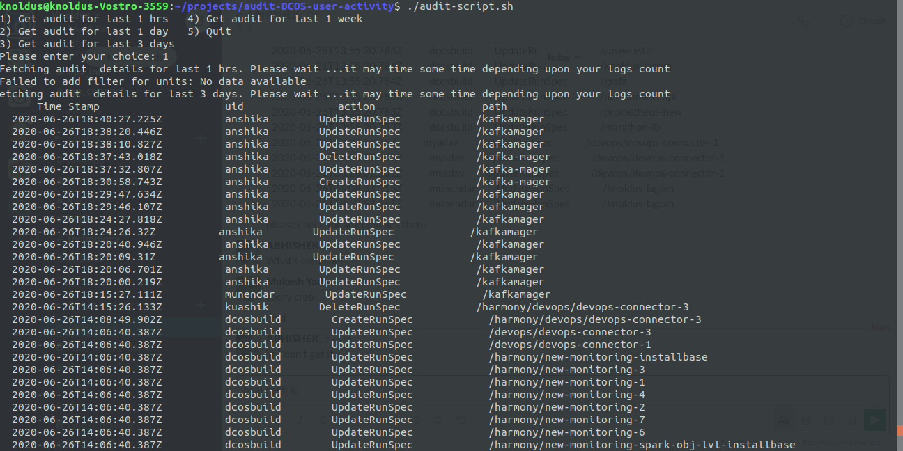

## Audit DCOS User Activity    
This Template demonstrate a sample script to fetch all docs log for given time and filter them out to get user activity in DCOS.
As part of the audit DCOS user activity you need to go to the system on which DCOS is installed and make your script run on system. 

To get user details that have make chnage you need to have `sudo` access for getting log of system :
 
    dashboardName:folderName    
  
### Make your script executable

This repository include the script that need to make executrable for your system :

    chmod +x ./src/audit-script.sh 
### Sample 

This is example that what I have executed on my system.

    List of dashboards are as follow :-

    1) Get audit for last 1 hrs   4) Get audit for last 1 week
    2) Get audit for last 1 day   5) Quit
    3) Get audit for last 3 days
    Please enter your choice: 1
    Fetching audit  details for last 1 hrs. Please wait ...it may time some time depending upon your logs count

As you can see image there is time of action (Update/Delete/Create)`timestamp` , user `uid` , `Action` that he/she has perform and `path` of applcation on which action is perform on DCOS.

